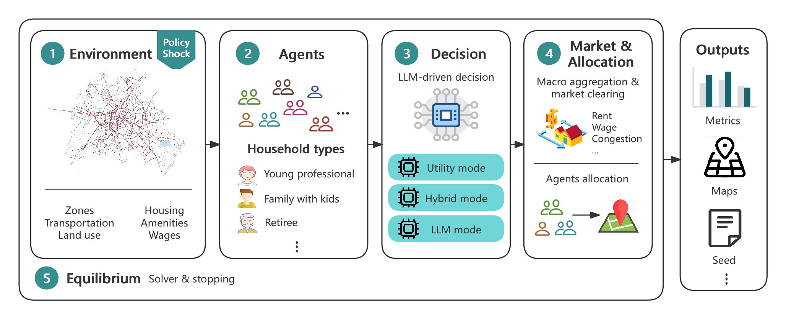

# agent-urban-planning

[](LICENSE)
[](https://www.python.org)

> **Anonymized for double-blind review.** Repository, documentation, and PyPI distribution URLs in this README have been replaced with the anonymized mirror at [https://anonymous.4open.science/r/agent-urban-planning-4B4D](https://anonymous.4open.science/r/agent-urban-planning-4B4D). Public hosting URLs will be restored in the camera-ready version.

Companion code, data, and reproduction pipeline for the NeurIPS Datasets & Benchmarks 2026 paper:

> **AUP: A Benchmark of Decision-Engine Architectures for Spatial-Equilibrium Urban Planning**

## What this repo is for

This repository is a benchmarking framework for evaluating decision-engine architectures in spatial-equilibrium urban-planning simulation. It targets three audiences.

- **Urban economists** can swap utility forms or market-clearing rules and compare against the calibrated Ahlfeldt et al. (2015) Berlin baseline.
- **Machine-learning and LLM-agent researchers** can evaluate foundation-model-driven choice rules under a controlled equilibrium harness with externally calibrated parameters.
- **Applied policy users** can run new cities, periods, or counterfactual shocks by editing YAML data files alone, with no engine code changes required.

The framework ships five reference decision engines (V1 through V5), a calibrated 96-zone Berlin Ortsteile benchmark instance derived from Ahlfeldt et al. (2015) under a hypothetical East-West Express transit shock, and a four-tier reproduction ladder ranging from a clean clone walkthrough to bit-identical headline reproduction without LLM credits.

## Reference decision engines

Five reference decision-engine variants ship as first-class API classes, configurable via kwargs.

| Paper variant                         | One-line description                          | API call                                                                                                       |
| ------------------------------------- | --------------------------------------------- | -------------------------------------------------------------------------------------------------------------- |
| **V1** Baseline-softmax         | Closed-form Cobb-Douglas + Fréchet softmax   | `aup.UtilityEngine(mode="softmax")`                                                                          |
| **V2** Baseline-ABM argmax      | ABM with Fréchet idiosyncratic preferences   | `aup.UtilityEngine(mode="argmax", noise="frechet")`                                                          |
| **V3** Normal-ABM argmax        | ABM with Gaussian idiosyncratic preferences   | `aup.UtilityEngine(mode="argmax", noise="normal")`                                                           |
| **V4** Hybrid-ABM               | LLM-elicited preferences + closed-form choice | `aup.HybridDecisionEngine(elicitor=...)`                                                                     |
| **V5** LLM-ABM (paper headline) | Full LLM-as-decision-maker, score-all-96      | `aup.LLMDecisionEngine(response_format="score_all", rebalance_instruction=True, stage2_top_k_residences=10)` |

## Workflow



The simulator is organized as a five-stage pipeline. **(1) Environment** — a city is described by zones, transportation graphs, land-use parameters, housing, amenities, and wages, with an optional policy shock that perturbs this state (e.g., a new rapid-transit line). **(2) Agents** — a population of heterogeneous household types (young professionals, families with kids, retirees, …) with demographic and preference attributes. **(3) Decision** — each agent picks a (residence, workplace) pair via one of three swappable engines: a closed-form `UtilityEngine` (V1–V3), a `HybridDecisionEngine` that elicits LLM-side preferences and resolves choice in closed form (V4), or a full `LLMDecisionEngine` that consults a language model end-to-end (V5 — the paper headline). **(4) Market & Allocation** — the macro layer aggregates choices, clears the housing/labor markets via tâtonnement (rents, wages, congestion), and allocates agents to zones. **(5) Equilibrium** — a fixed-point solver iterates 1→4 until prices and choices stop moving. Output is a bundle of welfare metrics, choropleth maps, and per-agent traces with a recorded seed for replay.

## Quickstart

```bash
curl -L -o aup.zip 'https://anonymous.4open.science/api/repo/agent-urban-planning-4B4D/zip'
unzip aup.zip -d agent-urban-planning-4B4D
cd agent-urban-planning-4B4D
python3 -m venv .venv
source .venv/bin/activate
pip install --upgrade pip
pip install -e ".[llm,plot,berlin]"
python examples/01_quickstart.py
```

The quickstart script walks through the five-stage pipeline (Environment → Agents → Decision → Market → Equilibrium) and runs a baseline simulation with V1 (closed-form softmax). Wall-clock <1 minute, no LLM credits required.

```python
import agent_urban_planning as aup
from agent_urban_planning.data.loaders import load_scenario, load_agents

# Stage 1+2 — Environment + Agents
scenario = load_scenario("data/berlin/scenarios/berlin_2006_ortsteile.yaml")
agent_config = load_agents("data/berlin/agents/berlin_ortsteile_richer_10k.yaml")

# Stage 3 — Decision engine (V1; swap to V2/V3/V4/V5 with one constructor change)
engine = aup.UtilityEngine(scenario.ahlfeldt_params, mode="softmax")

# Stage 4 — SimulationEngine + market clearing (Stage 5 = result.metrics)
sim = aup.SimulationEngine(scenario=scenario, agent_config=agent_config,
                           engine=engine, seed=42)
result = sim.run(policy=None)

print(result.metrics.avg_utility, result.metrics.gini_coefficient)
```

The other 4 paper variants (V2, V3, V4, V5) swap only the decision engine — see the variant table above.

## Berlin replication results

We benchmark all five variants on a 96-zone Berlin scenario (Ahlfeldt et al. 2015 calibration) under a hypothetical East-West Express rapid-transit shock (4 stations, 5-min between adjacent).

### Choropleth: log-change in housing prices Δlog Q under the shock


The structural family (V1, V2, V3, V4) produces a visibly *focal* response — price effects concentrate at the four station catchments. **LLM-ABM (V5)** instead spreads the response broadly across the city, picking up the gradient-flattening + agglomeration effects that exogenous-productivity models forbid.

### Choropleth: log-change in wages Δlog w under the shock


The wage maps tell the same story at the workplace side: structural variants forbid the agglomeration channel by construction (productivity `A_i` is exogenous), while LLM-ABM produces a coherent compensating-differential pattern via its training-data priors on urban economics.

### Cross-variant moments

Distribution-shape moments across the 96 zones (baseline → shock):

| Variant                  |         μ ΔlogQ |        σ ΔlogQ |    p95\|ΔlogQ\| |              ΔY% |            Δ Q̄ |            Δ⟨U⟩ |
| ------------------------ | ----------------: | ---------------: | ---------------: | ----------------: | ----------------: | -----------------: |
| V1   Baseline-softmax    |           +0.0004 |           0.0070 |           0.0083 |           +0.0007 |           +0.0008 |           −0.0032 |
| V2   Baseline-ABM argmax |           +0.0004 |           0.0071 |           0.0080 |          −0.0000 |           +0.0007 |           −0.0031 |
| V3   Normal-ABM argmax   |           +0.0004 |           0.0042 |           0.0048 |           +0.0132 |           +0.0001 |           −0.0027 |
| V4 Hybrid-ABM            |           +0.0004 |           0.0068 |           0.0077 |           +0.0002 |           +0.0007 |           −0.0031 |
| **V5 LLM-ABM**     | **+0.0016** | **0.0083** | **0.0172** | **+0.0299** | **+0.0111** | **−0.0056** |

Full table + interpretation: [`figures/comparison_moments.csv`](figures/comparison_moments.csv).

**Three takeaways.**

1. **The structural family agrees.** V1, V2, V4 (and V3 modulo Gaussian-vs-Fréchet tail differences) cluster tightly on `μ ≈ +0.0004`, `σ ≈ 0.007`, `Δ⟨U⟩ ≈ −0.0031`. They share the Cobb-Douglas + Fréchet architecture, and the noise model and clustering wash out at zone-level moments. **Architecturally distinct simulators give the same answer to a small policy shock — a useful sanity check for the structural family.**
2. **LLM-ABM is qualitatively different.** Its mean log-change in housing price is 4× the structural consensus, spread (σ, p95) is 1.2–2× larger, mean rent change is 14× larger, and aggregate productivity gain (+3%) is the only sizable positive value. Welfare drop is ~2× the structural family's.
3. **All five agree on welfare direction.** Δ⟨U⟩ < 0 across the board under the Baseline-softmax welfare ruler — the shock is a (small) net welfare loss. The mechanisms differ: structural variants attribute the drop to commute/wage compensation, while LLM-ABM picks up the same direction at ~2× magnitude because its equilibrium reroutes more agents to lower-utility configurations under the structural ruler's lens.

The full paper §6 discusses why LLM-ABM diverges (gradient-flattening + agglomeration, both forbidden in exogenous-productivity structural models).

## Authentication for live LLM runs

The Tier 3d V4 cache replay (`run_v4_hybrid.py --no-llm`), the Tier 4 V5 cache replay (`run_v5_score_all.py --no-llm`), and Tiers 1–3c (V1/V2/V3, all closed-form) need **no** API keys. Only Tier 3d-live (V4 from scratch) and Tier 4-live (V5 from scratch) call external LLMs.

For those, copy `.env.example` to `.env` and fill in the variable for your provider:

```bash
cp .env.example .env
# Edit .env with the key(s) for the provider you'll use.
```

Both `run_v4_hybrid.py` and `run_v5_score_all.py` call `load_dotenv()` at startup, so `.env` is picked up automatically.

| `--llm-provider` | What you need |
| --- | --- |
| `anthropic` | `ANTHROPIC_API_KEY=sk-...` in `.env` |
| `openai` | `OPENAI_API_KEY=sk-...` in `.env` |
| `zai-coding` | `ZAI_API_KEY=...` in `.env` |
| `codex-cli` | OAuth — run `codex login` once (no key in `.env`) |
| `claude-code` | OAuth — run `claude` interactively once (no key in `.env`) |

## Reproduce the paper results

The paper's V1–V5 Berlin runs (baseline + East-West Express shock) reproduce end-to-end from a clean ZIP download. Pick a path:

```bash
curl -L -o aup.zip 'https://anonymous.4open.science/api/repo/agent-urban-planning-4B4D/zip'
unzip aup.zip -d agent-urban-planning-4B4D
cd agent-urban-planning-4B4D
python3 -m venv .venv
source .venv/bin/activate
pip install --upgrade pip
pip install -e ".[llm,plot,berlin]"

# Tier 1+2 — quickstart pipeline walkthrough (<1 min, V1 baseline only)
python examples/01_quickstart.py

# Tier 3 — V1/V2/V3 closed-form + ABM variants (~3 hr each, no LLM credits)
python examples/02_berlin_replication/run_v1_softmax.py
python examples/02_berlin_replication/run_v2_argmax_frechet.py
python examples/02_berlin_replication/run_v3_argmax_normal.py

# Tier 3d — V4 hybrid. Two paths.
#   Path A: replay the bundled per-agent preference cache (~3 hr, no credits, recommended for reviewers)
python examples/02_berlin_replication/run_v4_hybrid.py --no-llm
#   Path B: rerun from scratch with live LLM elicitation (~3 hr, ~$5 in credits)
# python examples/02_berlin_replication/run_v4_hybrid.py --llm-provider codex-cli

# Tier 4 — V5 LLM-ABM, paper headline. Two paths.
#   Path A: replay the bundled cache (~5–10 min, no credits, recommended for reviewers)
curl -L -o llm_cache_v5.tar.gz \
  https://huggingface.co/datasets/aup-anon-2026/AUP-V5-LLM-cache-Berlin-Ortsteile/resolve/main/llm_cache_v5.tar.gz
tar -xzf llm_cache_v5.tar.gz -C data/berlin/
python examples/02_berlin_replication/run_v5_score_all.py --no-llm

#   Path B: rerun from scratch with live LLM (~10 hr, ~$30–50 credits)
python examples/02_berlin_replication/run_v5_score_all.py --llm-provider codex-cli

# After all five variants finish — build the paper's tables and figures
python examples/02_berlin_replication/build_moments_table.py
python examples/02_berlin_replication/plot_dlogQ_dlogw.py
```

| Tier           | What                                              | Wall-clock | LLM credits |
| -------------- | ------------------------------------------------- | ---------- | ----------- |
| **1**    | `pip install` + `import agent_urban_planning` | <30 s      | No          |
| **2**    | `examples/01_quickstart.py`                     | <10 s      | No          |
| **3a-c** | V1, V2, V3 Berlin baseline + shock                | ~3 hr each | No          |
| **3d**   | V4 Berlin baseline + shock (cache replay)         | ~3 hr      | No          |
| **3d**   | V4 Berlin baseline + shock (live LLM)             | ~3 hr      | ~$5         |
| **4**    | V5 Berlin baseline + shock (cache replay)         | ~5–10 min | No          |
| **4**    | V5 Berlin baseline + shock (live LLM)             | ~10 hr     | ~$30–50    |

**Detailed instructions** (real-run params, smoke testing, all 6 LLM provider options, cross-variant analysis snippets, numerical-reproducibility expectations) are in [`examples/02_berlin_replication/README.md`](examples/02_berlin_replication/README.md). The full reproducibility tier ladder lives at [`docs/reproducibility/berlin_v1_v5.md`](docs/reproducibility/berlin_v1_v5.md) (also rendered at [https://anonymous.4open.science/r/agent-urban-planning-4B4D/en/latest/reproducibility/berlin_v1_v5.html](https://anonymous.4open.science/r/agent-urban-planning-4B4D/en/latest/reproducibility/berlin_v1_v5.html)).

## Documentation

Comprehensive API reference, tutorials, and concept guides:

→ [https://anonymous.4open.science/r/agent-urban-planning-4B4D](https://anonymous.4open.science/r/agent-urban-planning-4B4D)

## Repository layout

```
agent-urban-planning/
├── src/agent_urban_planning/      Library source
│   ├── core/                       Environment / Agents / Market / Engine / Metrics
│   ├── decisions/                  UtilityEngine / HybridDecisionEngine / LLMDecisionEngine
│   ├── data/                       Loaders + builtin scenarios
│   ├── analysis/                   Welfare + plotting
│   ├── llm/                        LLM client wrappers
│   └── research/                   Paper-specific helpers (Berlin)
├── examples/
│   ├── 01_quickstart.py            Full V1 pipeline walkthrough (<1 min)
│   └── 02_berlin_replication/      End-to-end V1–V5 Berlin runs + paper-table builder
├── data/                           Bundled Berlin data (git, not PyPI sdist)
├── docs/                           Sphinx documentation source
├── figures/                        README assets (workflow, choropleths, tables)
└── pyproject.toml
```

## Citation

If you use this software in your research, please cite the accompanying paper (see [`CITATION.cff`](CITATION.cff)).

## License

[MIT License](LICENSE) © 2026 The agent-urban-planning Authors

## Acknowledgements

The Berlin replication is built on the Ahlfeldt, Redding, Sturm, Wolf (2015) "The Economics of Density: Evidence from the Berlin Wall" *Econometrica* 83(6) data and methodology. We are grateful for the authors' public release of the replication package; the data files in `data/berlin/` and `data/shapefiles/` derive from that release. See `data/README.md` for full attribution.
